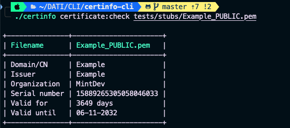
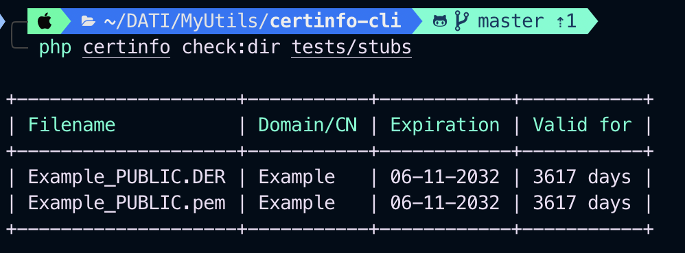

# Certinfo

A CLI application that shows Certificate Information of single X509 certificate (PEM and DER format) or multiple certificates (check a directory)

This can also be used for converting PEM certificate to DER and vice-versa

------

## User Installation

### Global installation

You can install the binary in global composer directory:

```
composer global require marco-introini/certinfo-cli
```

------

## Usage

All the available commands are visible using:

```
certinfo
```

### Check a single file

```
certinfo check:file <filename>
```

_filename_ can be a PEM, CRT, CER or DER file



### Check every file in a directory

```
certinfo check:directory <directory>
```



### Check an HTTPS Url

```
certinfo check:url <url>
```

### Convert PEM to DER

```
certinfo convert:pem2der <filename>
```

### Convert DER to PEM

```
certinfo convert:der2pem <filename>
```

------

## Developer information

Inside the Makefile there is the build command to create the executable

### Test

There are several test written using Pest inside the tests/Feature directory.

Before executing Pest you must generate stub certificates inside the tests/stubs directory. 
There is a Makefile recipe for automating everything:

```
make test
```

------

## Thanks

This package is based on Laravel Zero.

Laravel Zero was created by [Nuno Maduro](https://github.com/nunomaduro) and [Owen Voke](https://github.com/owenvoke), and is a micro-framework that provides an elegant starting point for your console application. It is an **unofficial** and customized version of Laravel optimized for building command-line applications.

------


## Support the development

If you like my work you can buy me a coffee

- via [PayPal](https://paypal.me/marcointroini)

## License

This is an open-source software licensed under the MIT license.
